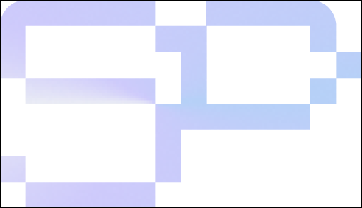

# 🚀 Sangalabror Pujianto - Portfolio Website v2.1

A modern, responsive portfolio website built with cutting-edge web technologies and powered by a headless CMS for seamless content management.



## ✨ Features

- **Headless CMS** - Sanity.io integration for easy content management
- **Embedded Studio** - Edit content directly at `/studio`
- **Responsive Design** - Optimized for all devices (desktop, tablet, mobile)
- **Smooth Animations** - GSAP-powered animations for engaging user experience
- **Modern UI/UX** - Clean, professional design with Tailwind CSS
- **Performance Optimized** - Built with Next.js 16 App Router
- **Interactive Components** - Dynamic project showcases and timeline
- **SEO Friendly** - Built-in SEO optimization with Next.js metadata
- **TypeScript** - Full type safety throughout the codebase
- **Auto-Revalidation** - Webhook-based content updates in real-time
- **Animated Gradient Blobs** - GSAP-animated purple gradient blobs that move across the background
- **Cursor Edge Glow** - Interactive border glow effect that follows cursor position

## 🛠️ Tech Stack

### Frontend Framework
- **Next.js 16** - React framework with App Router and Turbopack
- **React 18** - Latest React features and hooks
- **TypeScript** - Full type safety and better developer experience

### Content Management
- **Sanity.io** - Headless CMS for content management
- **Sanity Studio** - Embedded content editor at `/studio`
- **GROQ** - Sanity's query language for data fetching
- **Portable Text** - Rich text content from Sanity

### Styling & UI
- **Tailwind CSS** - Utility-first CSS framework
- **DaisyUI** - Component library for Tailwind CSS
- **PostCSS** - CSS processing and optimization

### Animations
- **GSAP** - Professional-grade animations
- **@gsap/react** - React integration for GSAP

### UI Components
- **Headless UI** - Unstyled, accessible UI components
- **Heroicons** - Beautiful SVG icons
- **React Icons** - Popular icon libraries

### Development Tools
- **ESLint** - Code quality and consistency
- **TypeScript** - Static type checking
- **Autoprefixer** - CSS vendor prefixing

## 🚀 Getting Started

### Prerequisites
- Node.js 18+ 
- npm, yarn, pnpm, or bun
- Sanity.io account (free tier available)

### Installation

1. **Clone the repository**
   ```bash
   git clone https://github.com/yourusername/sangalabror-portofolio.git
   cd sangalabror-portofolio
   ```

2. **Install dependencies**
   ```bash
   npm install
   # or
   yarn install
   # or
   pnpm install
   # or
   bun install
   ```

3. **Set up Sanity.io**

   a. Create a Sanity project at [sanity.io/manage](https://www.sanity.io/manage)
   
   b. Copy `.env.local.example` to `.env`
   
   c. Update environment variables:
   ```bash
   NEXT_PUBLIC_SANITY_PROJECT_ID=your-project-id
   NEXT_PUBLIC_SANITY_DATASET=production
   NEXT_PUBLIC_SANITY_API_VERSION=2024-01-01
   NEXT_PUBLIC_SANITY_USE_CDN=false
   SANITY_REVALIDATE_SECRET=your-random-secret
   ```

4. **Run the development server**
   ```bash
   npm run dev
   # or
   yarn dev
   # or
   pnpm dev
   # or
   bun dev
   ```

5. **Access the application**
   - **Website**: [http://localhost:3000](http://localhost:3000)
   - **Sanity Studio**: [http://localhost:3000/studio](http://localhost:3000/studio)

## 📁 Project Structure

```
sangalabror-portofolio/
├── src/
│   ├── app/                    # Next.js App Router
│   │   ├── (main)/            # Main app route group
│   │   │   ├── about/         # About page
│   │   │   ├── education/     # Education page
│   │   │   ├── experience/    # Experience page
│   │   │   ├── links/         # Links page
│   │   │   ├── projects/      # Projects page
│   │   │   │   └── [slug]/    # Dynamic project pages
│   │   │   └── layout.tsx     # Main layout
│   │   ├── (studio)/          # Studio route group
│   │   │   └── studio/        # Sanity Studio
│   │   ├── api/
│   │   │   └── revalidate/    # Webhook endpoint
│   │   ├── components/        # Reusable components
│   │   │   ├── BorderGlow.tsx         # Cursor edge glow effect
│   │   │   ├── GradientBlobs.tsx      # Animated background blobs
│   │   │   ├── useGradientBlobs.ts    # GSAP animation hook for blobs
│   │   │   └── ...
│   │   ├── globals.css        # Global styles
│   │   └── layout.tsx         # Root layout
│   ├── sanity/
│   │   ├── schemas/           # Sanity schemas
│   │   │   ├── project.ts     # Project schema
│   │   │   ├── experience.ts  # Experience schema
│   │   │   ├── education.ts   # Education schema
│   │   │   └── siteSettings.ts # Site settings schema
│   │   ├── lib/
│   │   │   ├── queries.ts     # GROQ queries
│   │   │   └── fetch.ts       # Data fetching functions
│   │   ├── client.ts          # Sanity client config
│   │   ├── env.ts             # Environment variables
│   │   └── image.ts           # Image URL builder
│   └── types/
│       ├── sanity.ts          # Sanity type definitions
│       └── components.ts      # Component type definitions
├── public/                     # Static assets
├── sanity.config.ts           # Sanity Studio configuration
├── tailwind.config.ts         # Tailwind configuration
├── next.config.ts             # Next.js configuration
├── tsconfig.json              # TypeScript configuration
└── package.json               # Dependencies and scripts
```

## 🎨 Content Management

### Sanity Studio
Access the embedded Sanity Studio at `/studio` to manage:
- **Projects** - Portfolio projects with images, descriptions, and tech stack
- **Experience** - Work experience with timeline
- **Education** - Educational background and certifications
- **Site Settings** - CV/Resume file upload

### Content Types

#### Projects
- Title, slug, year
- Short & full descriptions (Portable Text)
- Tech stack array
- Multiple showcase images with captions
- External links
- Order for sorting

#### Experience
- Company, role, dates
- Current position flag
- Description (Portable Text)
- Technologies used
- Order for sorting

#### Education
- Institution, degree, year
- Description
- Order for sorting

#### Site Settings
- CV/Resume PDF upload
- Automatically served via navbar and links page

## 🔄 Data Flow

1. **Content Creation** - Edit content in Sanity Studio (`/studio`)
2. **Publish** - Click publish to save changes
3. **Webhook** - Sanity triggers revalidation webhook
4. **Auto-Update** - Next.js rebuilds affected pages
5. **Live** - Changes appear on the live site

## 🚀 Available Scripts

- `npm run dev` - Start development server
- `npm run build` - Build for production
- `npm run start` - Start production server
- `npm run lint` - Run ESLint
- `npm run type-check` - Run TypeScript compiler check

## 🌐 Deployment

### Prerequisites
1. Push code to GitHub
2. Have a Sanity project set up

### Vercel Deployment

1. **Connect to Vercel**
   - Go to [vercel.com](https://vercel.com)
   - Import your GitHub repository
   - Select Next.js as framework

2. **Add Environment Variables**
   ```bash
   NEXT_PUBLIC_SANITY_PROJECT_ID=your-project-id
   NEXT_PUBLIC_SANITY_DATASET=production
   NEXT_PUBLIC_SANITY_API_VERSION=2024-01-01
   NEXT_PUBLIC_SANITY_USE_CDN=true
   SANITY_REVALIDATE_SECRET=your-random-secret
   ```

3. **Deploy**
   - Click Deploy
   - Wait for build to complete

### Sanity Configuration

1. **Add CORS Origin**
   - Go to [sanity.io/manage](https://www.sanity.io/manage)
   - Select your project
   - API → CORS Origins
   - Add: `https://your-site.vercel.app`
   - Allow credentials: ✅

2. **Create Webhook**
   - API → Webhooks → Create webhook
   - **Name**: Vercel Revalidation
   - **URL**: `https://your-site.vercel.app/api/revalidate`
   - **Dataset**: production
   - **Trigger on**: Create, Update, Delete
   - **Secret**: (paste your `SANITY_REVALIDATE_SECRET`)
   - **HTTP Method**: POST
   - Save

3. **Add Studio URL**
   - Studio → Studio URLs
   - Add: `https://your-site.vercel.app/studio`
   - Save

### Testing Deployment

1. Visit your production site
2. Go to `/studio` and make a content change
3. Publish the change
4. Wait 5-10 seconds
5. Refresh the site - changes should appear!

## 📱 Responsive Design

The portfolio is fully responsive with:
- **Mobile-first approach** - Optimized for mobile devices
- **Tablet optimization** - Enhanced experience on tablets
- **Desktop excellence** - Full-featured desktop experience
- **Device-specific redirects** - Smart routing based on device type

## 🎯 Performance Features

- **Image optimization** - Next.js Image component with Sanity CDN
- **Code splitting** - Automatic route-based code splitting
- **ISR (Incremental Static Regeneration)** - Fresh content with caching
- **Server Components** - Optimized data fetching
- **Webhook revalidation** - Instant content updates
- **SEO optimization** - Built-in meta tags and sitemap
- **CDN caching** - Sanity CDN for fast content delivery (production)

## 🔐 Security

- **Environment Variables** - Sensitive data stored securely
- **Webhook Signature Verification** - Validates Sanity webhook requests
- **CORS Configuration** - Restricted API access
- **No exposed tokens** - Read-only public access

## 🤝 Contributing

While this is a personal portfolio, suggestions and feedback are welcome:

1. Fork the repository
2. Create a feature branch
3. Make your changes
4. Submit a pull request

## 📝 Version History

### v2.2.0
- ✨ Added animated gradient blobs background with GSAP animations

### v2.1.0
- ✨ Added cursor-following edge glow effect (BorderGlow component)
- ✨ Enhanced visual effects with gradient text styling
- ✨ Improved navbar button interactions with icon support

### v2.0.0
- ✨ Migrated to TypeScript
- ✨ Upgraded to Next.js 16
- ✨ Integrated Sanity.io headless CMS
- ✨ Added embedded Sanity Studio
- ✨ Implemented webhook-based auto-revalidation
- ✨ Added CV management through CMS
- ✨ Dynamic project pages with GROQ queries
- ✨ Improved data fetching with Server Components

### v1.0.0
- Initial release with hardcoded content
- Next.js 14 with App Router
- GSAP animations
- Tailwind CSS styling

## 📄 License

This project is open source and available under the [MIT License](LICENSE).

## 📞 Contact

- **Portfolio**: [sangalabror.aebroyx.dev](https://sangalabror.aebroyx.dev)
- **GitHub**: [aebroyx](https://github.com/aebroyx)
- **LinkedIn**: [sangalabrorpujianto](https://linkedin.com/in/sangalabrorpujianto/)

---

⭐ **Star this repository if you found it helpful!**

Built with ❤️ using **Next.js 16**, **TypeScript**, **Tailwind CSS**, **GSAP**, and **Sanity.io**
